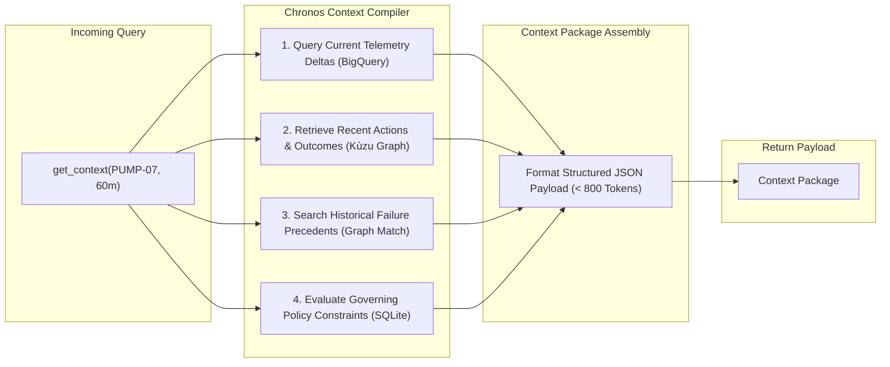

# CHRONOS — Context Retrieval Workflow Diagram

```mermaid
flowchart LR
    subgraph Request ["Incoming Query"]
        Q["get_context(PUMP-07, 60m)"]
    end

    subgraph Chronos_Pipeline ["Chronos Context Compiler"]
        Q --> S1["1. Query Current Telemetry Deltas (BigQuery)"]
        Q --> S2["2. Retrieve Recent Actions & Outcomes (Kùzu Graph)"]
        Q --> S3["3. Search Historical Failure Precedents (Graph Match)"]
        Q --> S4["4. Evaluate Governing Policy Constraints (SQLite)"]
    end

    subgraph Assembly ["Context Package Assembly"]
        S1 & S2 & S3 & S4 --> JSON["Format Structured JSON Payload (< 800 Tokens)"]
    end

    subgraph Output ["Return Payload"]
        JSON --> CP["Context Package"]
    end
```
