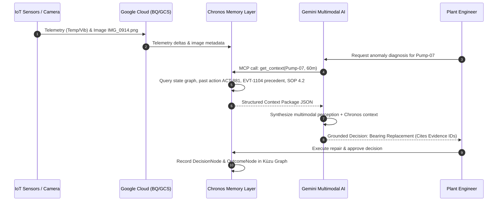

# CHRONOS — Data Flow Diagram

```mermaid
sequenceDiagram
    autonumber
    participant Sensors as IoT Sensors / Camera
    participant GCP as Google Cloud (BQ/GCS)
    participant Chronos as Chronos Memory Layer
    participant Gemini as Gemini Multimodal AI
    participant User as Plant Engineer

    Sensors->>GCP: Telemetry (Temp/Vib) & Image IMG_0914.png
    GCP->>Chronos: Telemetry deltas & image metadata
    User->>Gemini: Request anomaly diagnosis for Pump-07
    Gemini->>Chronos: MCP call: get_context(Pump-07, 60m)
    Chronos->>Chronos: Query state graph, past action ACT-881, EVT-1104 precedent, SOP 4.2
    Chronos-->>Gemini: Structured Context Package JSON
    Gemini->>Gemini: Synthesize multimodal perception + Chronos context
    Gemini-->>User: Grounded Decision: Bearing Replacement (Cites Evidence IDs)
    User->>Chronos: Execute repair & approve decision
    Chronos->>Chronos: Record DecisionNode & OutcomeNode in Kùzu Graph
```
