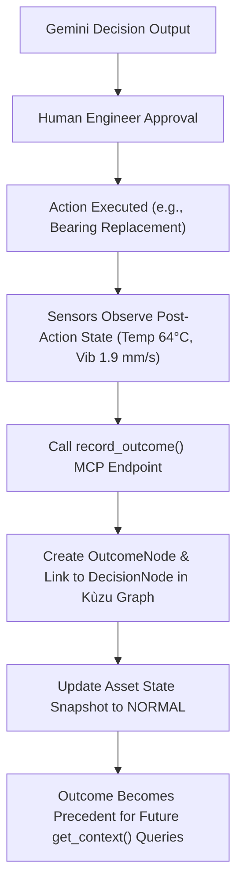

# CHRONOS — Decision Feedback Loop Diagram

```mermaid
graph TD
    A["Gemini Decision Output"] --> B["Human Engineer Approval"]
    B --> C["Action Executed (e.g., Bearing Replacement)"]
    C --> D["Sensors Observe Post-Action State (Temp 64°C, Vib 1.9 mm/s)"]
    D --> E["Call record_outcome() MCP Endpoint"]
    E --> F["Create OutcomeNode & Link to DecisionNode in Kùzu Graph"]
    F --> G["Update Asset State Snapshot to NORMAL"]
    G --> H["Outcome Becomes Precedent for Future get_context() Queries"]
```
