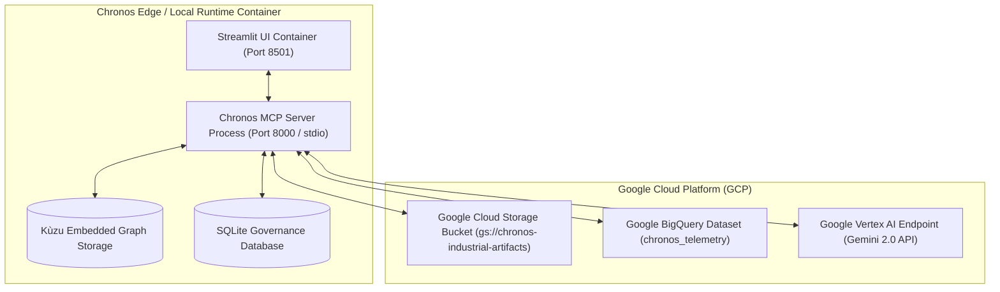

# CHRONOS — Deployment Architecture Diagram

```mermaid
graph TD
    subgraph Cloud_Environment ["Google Cloud Platform (GCP)"]
        GCS["Google Cloud Storage Bucket (gs://chronos-industrial-artifacts)"]
        BQ["Google BigQuery Dataset (chronos_telemetry)"]
        Vertex["Google Vertex AI Endpoint (Gemini 2.0 API)"]
    end

    subgraph Host_Environment ["Chronos Edge / Local Runtime Container"]
        Streamlit["Streamlit UI Container (Port 8501)"]
        MCPServer["Chronos MCP Server Process (Port 8000 / stdio)"]
        KuzuDB[("Kùzu Embedded Graph Storage")]
        SQLiteDB[("SQLite Governance Database")]

        Streamlit <--> MCPServer
        MCPServer <--> KuzuDB
        MCPServer <--> SQLiteDB
        MCPServer <--> Vertex
        MCPServer <--> BQ
        MCPServer <--> GCS
    end
```
