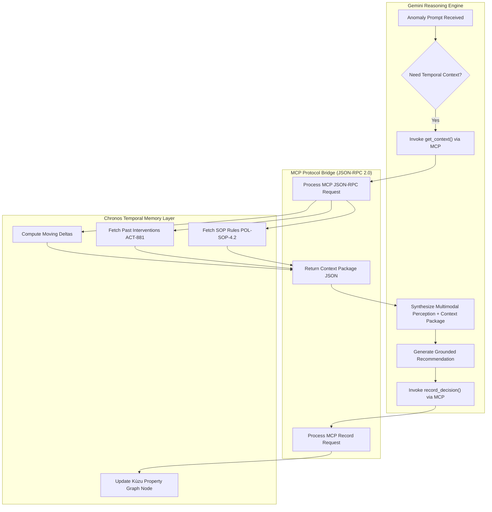

# CHRONOS — Gemini ↔ Chronos Interaction Diagram

```mermaid
flowchart TD
    subgraph Gemini_Agent ["Gemini Reasoning Engine"]
        A[Anomaly Prompt Received] --> B{Need Temporal Context?}
        B -- Yes --> C["Invoke get_context() via MCP"]
        F[Synthesize Multimodal Perception + Context Package] --> G[Generate Grounded Recommendation]
        G --> H["Invoke record_decision() via MCP"]
    end

    subgraph MCP_Bridge ["MCP Protocol Bridge (JSON-RPC 2.0)"]
        C --> D["Process MCP JSON-RPC Request"]
        E["Return Context Package JSON"] --> F
        H --> I["Process MCP Record Request"]
    end

    subgraph Chronos_Engine ["Chronos Temporal Memory Layer"]
        D --> J[Compute Moving Deltas]
        D --> K[Fetch Past Interventions ACT-881]
        D --> L[Fetch SOP Rules POL-SOP-4.2]
        J & K & L --> E
        I --> M[Update Kùzu Property Graph Node]
    end
```
