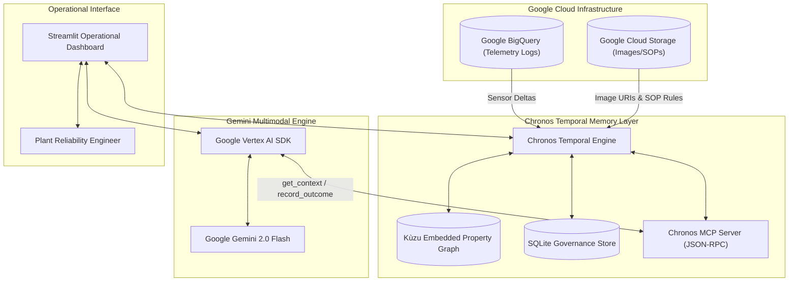

# CHRONOS — System Architecture Diagram

```mermaid
graph TD
    subgraph Data_Layer ["Google Cloud Infrastructure"]
        BQ[("Google BigQuery (Telemetry Logs)")]
        GCS[("Google Cloud Storage (Images/SOPs)")]
    end

    subgraph Chronos_Layer ["Chronos Temporal Memory Layer"]
        Kuzu[("Kùzu Embedded Property Graph")]
        SQLite[("SQLite Governance Store")]
        Engine["Chronos Temporal Engine"]
        MCP["Chronos MCP Server (JSON-RPC)"]

        Engine <--> Kuzu
        Engine <--> SQLite
        Engine <--> MCP
    end

    subgraph AI_Layer ["Gemini Multimodal Engine"]
        Vertex["Google Vertex AI SDK"]
        Gemini["Google Gemini 2.0 Flash"]

        Vertex <--> Gemini
        Vertex <-->|get_context / record_outcome| MCP
    end

    subgraph UI_Layer ["Operational Interface"]
        UI["Streamlit Operational Dashboard"]
        Operator["Plant Reliability Engineer"]

        UI <--> Operator
        UI <--> Vertex
        UI <--> Engine
    end

    BQ -->|Sensor Deltas| Engine
    GCS -->|Image URIs & SOP Rules| Engine
```
